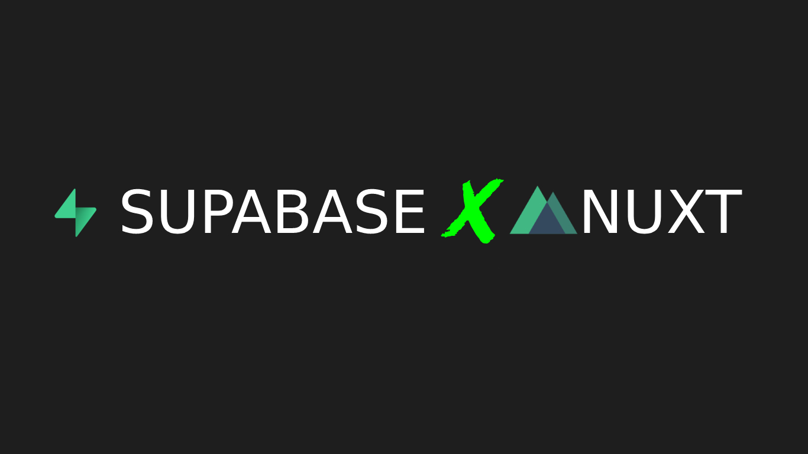

# nuxt-x-supabase-snippets README

## Features

These snippets were built to supercharge a workflow in the most seamless manner possible.

## Requirements

>npm i -D @nuxtclub/supabase
>
>[Nuxtclub Supabase](https://github_com.jam.dev/nuxtclub/supabase)

## Snippets

Snippet | Usage
------------- | -------------
!sburl  | snippet for supabase url and key
!fdata  | snippet for fetching data from db
!auth  |snippet for signin authentication from supabase 
!soauth  | snippet for signout authentication from supabase

## Release Notes

### 1.0.0

